# bamazone

 
Bamazon is  an Amazon-like storefront with the MySQL skills and node. The app will take in orders from customers and deplete stock from the store's inventory. 
Bamazon uses these node modules:  inquirer, Mysql.
They are all dependencies in the package.json, so just run:
npm install.
Bamazon uses some node modules and connects to a Mysql database to store and retrieve product and department information.
 
MySQL main Table has ten rows and 5 columns:

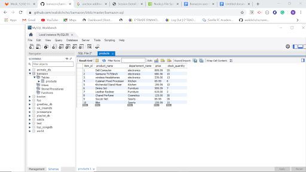
 
 
Customer Bamazon Module
 

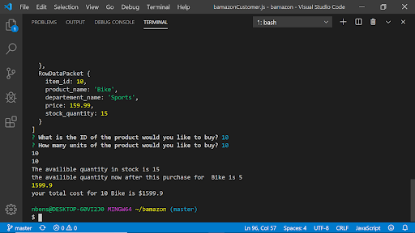

if there is no enough quantity, the system will say sorry:

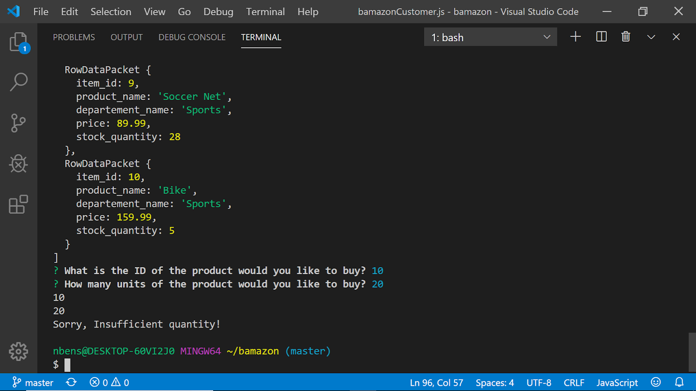

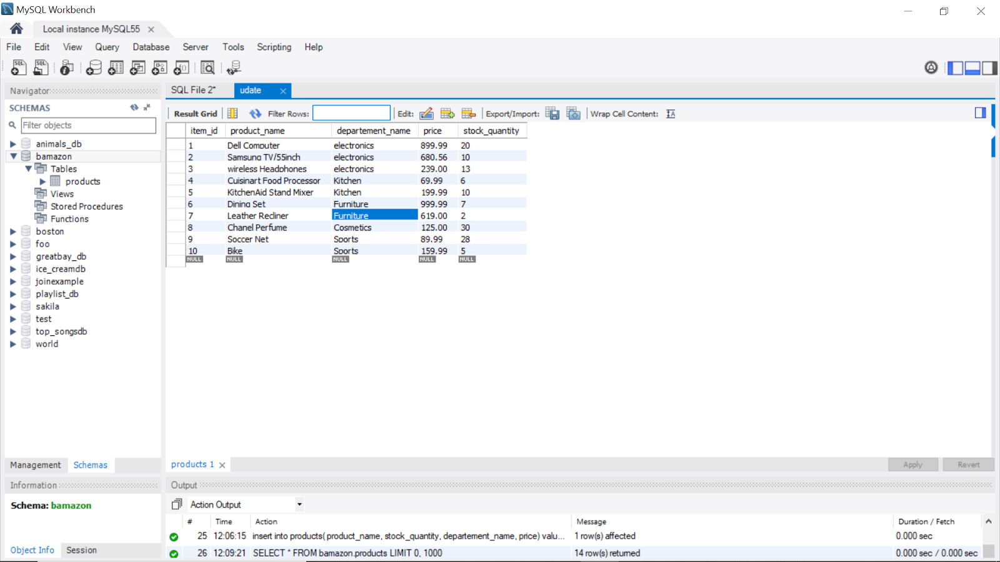

To run this module in the terminal:
node bamazonCustomer.js
 
Manager Bamazon Module
 
The manager module lets managers view the list of products, view low inventory, add inventory, and add products.
As part of adding a product, if the department doesn't exist, it will get added automatically, so the manager doesn't have to worry about it.
New products and new departments appear in the products and departments tables.
To run this module in the terminal:
node bamazonManager.js

=======Product For Sale=============

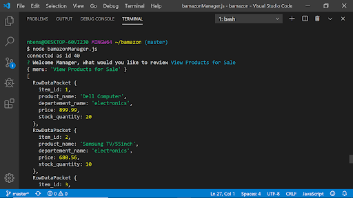

=======Low Inventrory===============

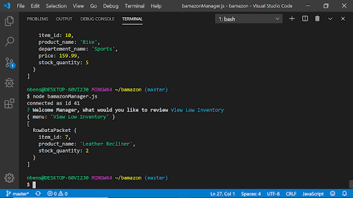

========Add Inventory =============

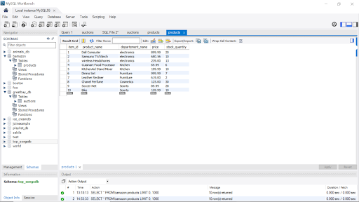

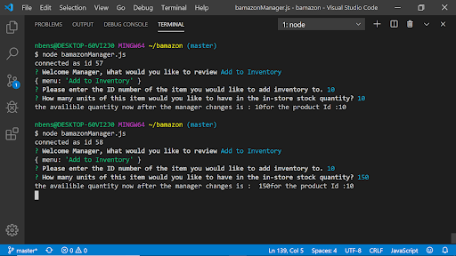

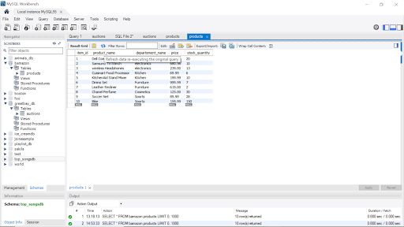

========Add Products =============

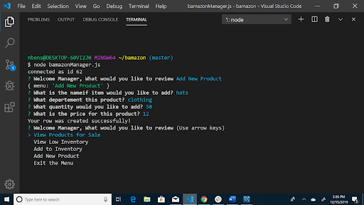

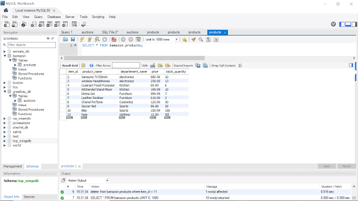

 

